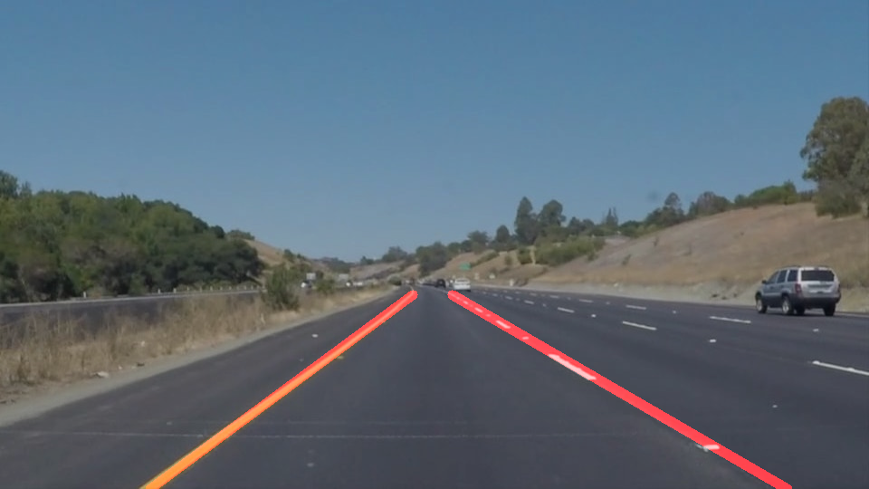

# **Finding Lane Lines on the Road** 

## Writeup Template

---

**Finding Lane Lines on the Road**

### Description of the pipeline.

My pipeline consists of two steps fundamentally,preprocessing and algorithmic. First, I converted the images to grayscale, and then I applied gaussian blur with suitable kernel to remove the noise.After blurring ,I applied canny edge detection to detect the edges on the image.I set the high threshold as 150 and subsequently low threshold as 50.Other parameters can be chosen as well.Further,I masked out the irrelevant portions of the image i.e the ones without lane lines.From camera's perpective I only needed to clip a trapezium from the bottom of the frame to focus on the lane lines.After filtering out the ROI,I applied hough tranform to find the set of line segments on it.These line segments together determine the left and right lane lines.

In order to draw a single line on the left and right lanes, I modified the draw_lines() in two ways:

The very first thing I did was to seperate the right and left lane lines.I used the sign of the slopes of the hough lines,the positive ones for the right lane and the ones with the negative slope for the left.Further I found out the outliers in the slope values and determined the range of right and left slopes and their behaviour.At the very first ,I ignored the lines with horizontal slopes.Subsequently,I selected the right lane lines with slope greater than 0.4 and left lane lines with slope less than -0.4.
After successfully seperating the left and right lane lines ,I applied two algorithms.

### 1.Regression
I applied simple linear regression on the left and right lane coordinate points to find the best fit lines for both left and right lane which I further extrapolated to the top and bottom of my ROI.

### 2.Weighted average of the slopes and intercepts.
Here,I caculated the weighted average of the slopes and intercepts for left and right lane lines acoording to the lengths of the lines i.e. the longer lines will contribute comparitively more to the slope and the interecept.

Both the methods worked fine but the second method ,the one that used weights was more smooth during the transitions and during the curves.Hence,I finally selected the second algorithm.

---

These are the images before and after applying the pipeline. 

![Original Image]

![Edited Image]

### 2. Shortcomings with the current pipeline.

One of the possible shortcoming of this pipeline is that the transitions won't be smoother on the road with more curvy lanes.Also ,the current pipleine can be made more smoother on videos,though it is giving nice results on the images already.

### 3. Possible improvements to the pipeline

A posible improvement to the current pipline would be to use the rich data of the previous slopes to induce a smoothing effect.That is,to determine the slope for a particular frame,the slopes of the previous two frames should be taken into account to prevent much deviations.This will work good on curvy roads as well.
